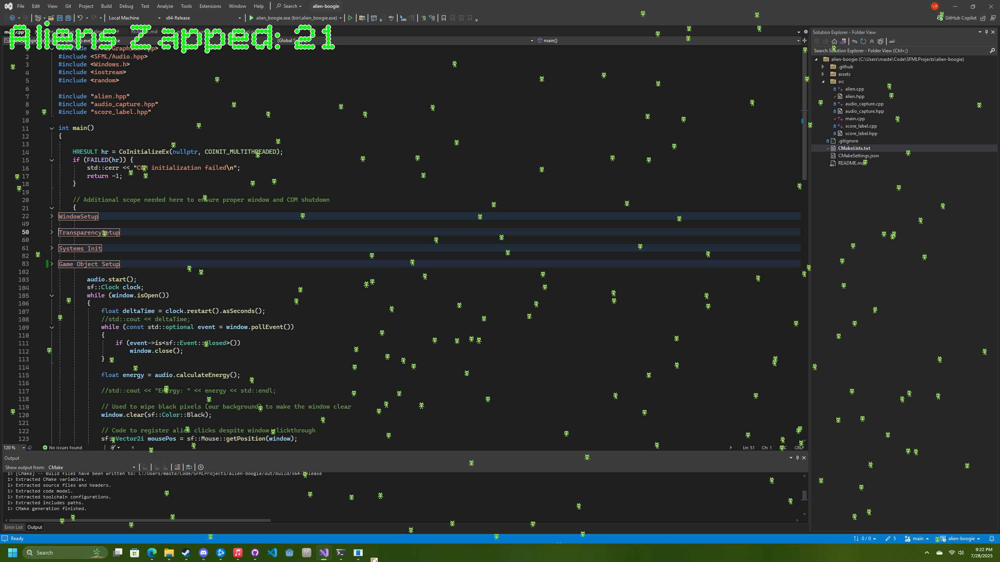

# Alien Boogie!

This is a small project made in SFML to leverage the C++ knowledge gleaned from [learncpp.com](https://www.learncpp.com/), 
and gain a deeper understanding of lower level game design and development.

## How to Play

As of now, this project is built solely for Windows, although additional platform support may be included in the future.

The built and ready .zip files can be found under *Releases* on the right hand side of the repo. To run Alien Boogie, the .zip file 
needs to be downloaded and extracted. Opening the extracted file will expose the .exe file for Alien Boogie, and double clicking it will launch the application (after a brief security scan).
The console window that appears can be safely minimized, but must stay active; closing the window will terminate the program.

## Gameplay
### Synopsis
The titular aliens of Alien Boogie love to do just that, Boogie. They will take over your desktop and idle, waiting for your next banger to start playing. They will boogie in response to any song, played on any streaming service.

### Controls
If you find their antics irritable, you can **zap** aliens by clicking on them individually, or by holding the left mouse button down and dragging the cursor over them.
The zapped aliens will fall off the screen, and your score will increase; however, do not expect them to stay down for long...

## Source Code

This project was scaffolded with the SFML CMake template. Visual Studio Community 2022 was used as the IDE. To build the application, open the repository in Visual Studio 2022. 
The IDE should start the necessary CMake build steps, and once concluded, the project can be built in either the Debug or Release configuration.
